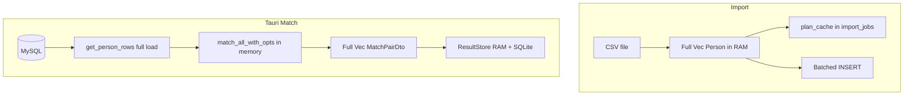
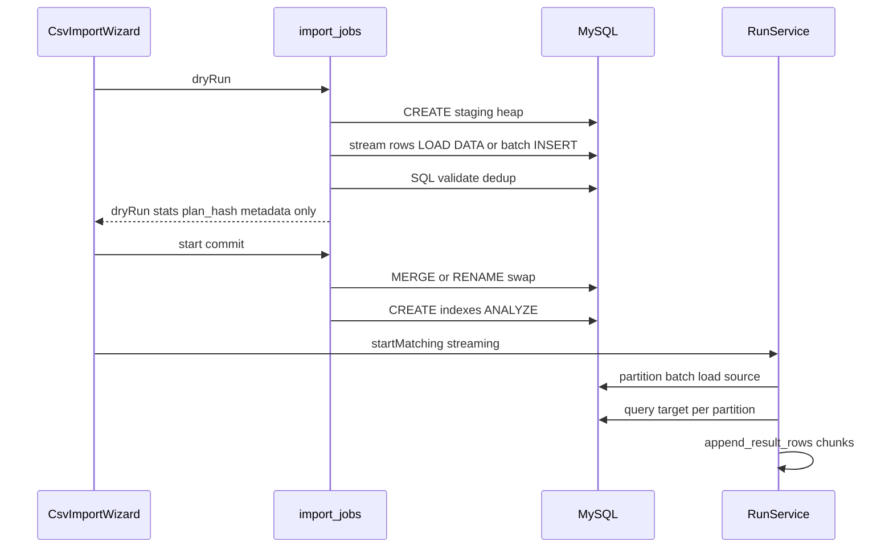

# Million-Row Scale Plan (Party-Mode Refined)

**Plan ID:** `million-row-scale-2026-05-27`
**Status:** Finalized for implementation after party-mode contract refinement
**Builds on:** [post-audit-remediation-plan.md](post-audit-remediation-plan.md) (Phases 1-4 import UX/cancel done)
**References:** [name_matcher_performance_remediation_plan.md](name_matcher_performance_remediation_plan.md) (staging import T10, batch matching T12), [csv-to-database-import-plan.md](csv-to-database-import-plan.md)

**Assumption:** Target workstation workloads of **~1–5M rows per table**, **16–32GB RAM**, MySQL on same host or low-latency LAN. **Both** CSV import and DB matching are in scope.

**Party-mode consensus:** Do **not** treat Configure “streaming” as done until `RunService` honors it. **Staging import** is required for million-row Replace, not optional. **Result spill + incremental append** matters for million **matches**, not only million **people**. **Cascade / fuzzy Deep Match at 1M** is a separate milestone (v2).

**Scale ladder:** 100k required CI smoke; 250k required local pre-merge gate; 1M ignored/manual release gate; 5M exploratory/operator-only gate. Each level must publish the same evidence schema.

---

## Implementation checklist

- [x] **Sprint 0:** Benchmark harness/evidence contract for 100k/250k/1M (`scripts/perf`), including `peak_rss_mb` in JSON; MySQL config capture via `scripts/perf/Capture-MysqlConfig.ps1`
- [x] **Sprint A-prime:** Staging table workflow + Replace `RENAME TABLE` swap (no pre-`TRUNCATE`)
- [x] **Sprint A-prime:** Stream CSV to staging; remove `Vec<Person>` from `plan_cache`; SQL dry-run dedup
- [x] **Sprint A-prime:** Cancel/fail staging cleanup + `partial_commit` job DTO fields
- [x] **Sprint B0/B1:** Shared scale policy, Summary/Run/Streaming UI gating + honest requested/effective mode labels
- [x] **Sprint C0:** Spill-aware `append_result_rows` + SQLite-first SQL paging/export foundation
- [x] **Sprint C1:** Incremental result append from streaming executor (`append_result_rows` per partition batch in Tauri stream runner)
- [x] **Sprint B-prime:** `RunService` streaming branch + Tauri loader for supported deterministic DB algorithms
- [x] **Sprint D (partial):** MySQL fixture doc, `tests/csv_import_mysql.rs` (smoke + replace cancel before swap), UI `runScalePolicy` tests, operator runbook (see [mysql-benchmark-fixture.md](mysql-benchmark-fixture.md))
- [ ] **Sprint D (remaining):** Browser/e2e viewport smoke, 200k+ results UI performance smoke, nightly docker-compose automation

---

## Problem today (verified in code)

| Bottleneck | Location | At ~1M rows |
|------------|----------|-------------|
| Full CSV parse + cache | `src/import/mod.rs`, `src-tauri/src/import_jobs.rs` `CachedImportPlan.people` | OOM risk |
| N+1 duplicate dry-run (10k cap) | `count_existing_duplicates` in import | Wrong counts on large append |
| Replace = TRUNCATE before load | `replace_table` | Cancel after truncate = empty table |
| Tauri loads full tables | `src-tauri/src/commands/matching.rs` | OOM risk |
| `config.streaming` unused | `src/run_service/mod.rs` `run_worker` | UI misleading |
| Results in RAM | `src/run_service/store.rs` `page_from_rows` | OOM on huge match sets |

**Already good (keep):** async import, cancel between batches, `plan_hash`, batch INSERT, SQLite write path exists, `ui/src/features/connect/CsvImportWizard.tsx` polling.

---

## Target architecture

---

## Sprint A-prime — Staging CSV import (P0, ~1–2 weeks)

**Goal:** Import 1M rows with **bounded process RAM** and **honest dry-run** on large existing tables.

### A1 — Staging table workflow

Implement in `src/import/mod.rs` + `src-tauri/src/import_jobs.rs`:

- Staging name: `{table}__stg_{job_id}`; same matcher columns + `stg_row_id`, optional `source_line`.
- Use real staging tables, not MySQL `TEMPORARY` tables, because `RENAME TABLE` cannot swap temporary tables.
- Preserve session database binding: all staging, validation, merge, swap, index, and cleanup queries must operate only inside the connected session database. Validate identifiers and never accept caller-provided staging table names.
- **Create / Replace:** load into staging first; **Replace uses one atomic `RENAME TABLE` swap**, not `TRUNCATE` on live table before validation (`replace_table` today is unsafe at scale).
- Replace commit algorithm:
  1. load and validate `{table}__stg_{job_id}`
  2. create indexes on staging before swap
  3. execute one MySQL `RENAME TABLE` statement: `{table}` TO `{table}__old_{job_id}`, `{table}__stg_{job_id}` TO `{table}`
  4. only after successful swap, drop `{table}__old_{job_id}`
  5. if swap fails, leave original `{table}` untouched and report cleanup instructions
- **Append:** merge staging → destination in chunks (50k–100k) with autocommit per chunk.

### A2 — Stream CSV → DB (no full `Vec<Person>`)

- Refactor `load_csv_people` in `src/loaders/csv_loader.rs` to expose **batch iterator** (reuse record loop; `CsvLoadOptions.should_cancel` already exists).
- **Remove `people` from `CachedImportPlan`** — cache only `{ plan_hash, dry_run, staging_table, session_id }`.
- Dry-run: stream into staging + SQL aggregates (`COUNT`, invalid rules, `GROUP BY` dup keys).
- Commit: reuse staging from dry-run when `plan_hash` matches (no second full parse).
- Staging reuse contract:
  - dry-run creates a durable staging table tagged with `{job_id, session_id, plan_hash, source_path, source_size, source_mtime}`
  - commit may reuse staging only when all metadata still matches
  - stale staging tables are dropped at app startup and before new dry-runs for the same session/table
  - failed/cancelled dry-runs must drop staging unless explicitly retained for debugging

### A3 — SQL duplicate detection

Replace per-row `SELECT` loop (10k cap) with:

- In-file dupes: `GROUP BY` normalized key on staging.
- Existing table: `JOIN staging → dest` against indexed normalized keys. Do not sample by default. If the destination lacks a usable index above threshold, mark the probe as `blocked_needs_index` and require temporary index creation or explicit user override. Sampling is diagnostics only; sampled counts are estimates and must not be used for destructive Replace safety.

### A4 — Bulk load strategy

- **v1 primary:** batched `INSERT` from stream (5k–20k rows).
- **v1.1 optional:** `LOAD DATA LOCAL INFILE` into staging when server + driver allow; expose `load_method` in job status.
- Drop redundant `count_csv_rows` full-file scan after streaming stats exist.

### A5 — Cancel / failure semantics

- Cancel between chunks (existing `CancelToken`).
- On cancel/fail: `DROP` staging; live table unchanged for Replace-with-swap.
- Job DTO: `partial_commit`, `destructive_step_completed` flags for UI honesty.
- Append mode is explicitly non-atomic in v1. Unless an `import_job_id` load marker is added for retry/resume cleanup, cancelled append jobs may require manual cleanup. Always report inserted/skipped/updated counts plus duplicate policy used.

**Gate:** 250k local smoke and 1M ignored/manual MySQL run record peak process RSS via benchmark JSON. Pass when import peak RSS stays under 1.5GB or under +20% versus the 100k scaled baseline, whichever is stricter. Attach raw JSON, command log, dataset manifest SHA-256, MySQL config snapshot, and proof that Replace cancel before swap leaves the old table intact.

---

## Sprint 0 — Benchmark harness and evidence contract (P0, before A/B/C)

**Goal:** Define pass/fail evidence before optimizing scale behavior.

- Extend `scripts/perf/Generate-Datasets.ps1`, `scripts/perf/Run-Benchmarks.ps1`, and `scripts/perf/Compare-Benchmarks.ps1` for deterministic 100k, 250k, and 1M CSV/DB datasets with fixed seeds and SHA-256 manifests.
- Capture peak RSS, MySQL version/config, dataset profile, row counts, indexes, cold/warm state, p50/p95/p99, result counts, candidate counts, exit code, pass/fail status, and raw logs.
- MySQL benchmark fixture is required for local/manual scale gates. Document Docker service, port, schema, `innodb_buffer_pool_size`, `local_infile`, indexes, warm/cold cache reset, and seed/import commands.
- No scale optimization is complete without committed benchmark JSON plus comparison markdown.

---

## Sprint C-prime — Results at scale (P1, storage foundation after A1; streaming append after B2)

**Goal:** Million **match rows** without holding full `Vec` in RAM for paging/export.

### C1 — Incremental persistence during match

In `src/run_service/mod.rs`:

- After match chunks produce pairs, call `store.append_result_rows` incrementally instead of one giant `dtos` vector at end (where algorithm allows).
- C0 can be validated with synthetic append fixtures before B-prime streaming exists. C1 wires real incremental append from the streaming executor after B2.
- Defer or gate `set_person_snapshots` (`t1.clone()`, `t2.clone()`) above row threshold.

### C2 — SQLite-first paging for large jobs

In `src/run_service/store.rs`:

- Threshold config e.g. `spill_rows: 100_000` — above threshold: keep metadata in memory, page via SQL `LIMIT/OFFSET` on `results` table (avoid `page_from_rows` full scan).
- `append_result_rows` must become spill-aware before RunService uses it for large jobs. For spill-mode jobs, do **not** extend `StoredJob.rows`; write directly to SQLite and keep only summary metadata/counters in memory.
- `ResultStore::page` must query SQLite with filters/sort/limit directly instead of calling `load_job()` or `page_from_rows()` for spilled jobs.
- Trim `source_people` / `target_people` after match unless explain needs them (lazy load from DB by id later = v2).
- Update all result consumers for spill mode: paging, export, diff, review decisions, explain/details. Any feature that still requires full `StoredJob.rows`, `source_people`, or `target_people` must be disabled with a clear message or converted to SQL-backed lookup.

### C3 — Results scale UX

- `ui/src/features/results/ResultsTab.tsx`: show a large-results banner when `total >= 100_000`; message must say paging is for review and Export is the recommended workflow.
- Lower default page size only through a named policy constant, not a local magic number.
- Search/sort/filter must continue through backend paging; do not fetch all results into the browser.
- Explanation/detail panels must show an honest unavailable/deferred state when person snapshots were trimmed.
- Export CTA must remain visible above the results table for large jobs.
- `ui/src/features/configure/ConfigureCards.tsx`: warn on `persist_result_history` at scale.

**Gate:** Synthetic 200k/1M match-row fixtures prove SQLite-backed paging uses SQL `LIMIT/OFFSET`, does not materialize all rows, exports expected counts, and records peak RSS. Evidence: result row count, page 1/middle/last timings, search/filter timings, export checksum, RSS samples, raw logs, and explanation-unavailable state when snapshots are trimmed.

---

## Sprint B-prime — Tauri bounded-memory matching (P2, ~2 weeks)

**Goal:** DB-backed runs honor `RunModeDto` / `StreamingOptionsDto` for **supported** algorithms.

### B0/B1 — Shared scale policy + honest UI gating

- Create one frontend policy helper, e.g. `ui/src/shared/runScalePolicy.ts`, used by `StreamingCard`, `SummaryCard`, `RunTab`, and `ResultsTab`.
- Policy inputs: source mode/table row count/file preview state, target mode/table row count/file preview state, requested `RunModeDto`, effective backend mode when available, selected algorithm/cascade mode, and result history/export settings.
- Thresholds: `<100k` rows per side = normal; `>=100k` = warning; `>=500k` = strong warning and confirmation before start; `>=1M` = block unsupported combinations.
- File sources at high scale must show “preview only” and require or recommend import-to-DB before matching. For 1M, CSV/Excel direct matching is blocked unless a future streaming file path is explicitly implemented.
- Deep Match/cascade and unsupported fuzzy paths must show “in-memory only — not for million-row runs.”
- `StreamingCard` must show both “Requested mode” and “Effective mode.” Until `RunService` proves streaming support, label streaming as “configured only — backend not active.”
- `RunTab.tsx` must block Start for unsupported high-scale combinations, not only warn.

### B2 — New streaming executor in RunService

**Do not** assume wiring `TableLoader` alone is enough — `run_worker` still builds full `pairs` + `dtos` today.

- Add branch in `run_worker` when `config.streaming.mode` is `streaming` or `auto` resolves to streaming (use `optimization::calculate_streaming_config` pattern from `src/bin/gui.rs`).
- Resolve effective streaming mode before calling `TableLoader`; supported DB-to-DB streaming runs must bypass `TableLoader` and must not call `get_person_rows` for full-table load.
- Call existing partitioned / DB streaming entry points in `src/matching/mod.rs` (`stream_match_*`, dual-pool variants) with pools from Tauri session.
- Emit matches through callback → incremental `append_result_rows`.

### B3 — Replace Tauri `TableLoader` for DB mode

- `src-tauri/src/commands/matching.rs`: when streaming, **do not** call `get_person_rows` for full table upfront.
- Keep full load path only for `in-memory` mode on small tables.

### B4 — Supported matrix (v1)

| Supported in B-prime | Deferred (document in UI) |
|----------------------|---------------------------|
| Exact / hash-join style DB algorithms that already stream in egui | **Cascade / Deep Match** (`run_cascade_inmemory`) |
| Partitioned streaming for large DB tables | **Fuzzy L10/L11** unless engine path explicitly allows |
| File sources only after import-to-DB recommended | Excel full-buffer import |

Before implementation, define exact mapping: `AlgorithmDto` → engine algorithm → streaming function, required source kinds, same-session vs dual-session pool support, and unsupported modes. UI can show Streaming as available only when backend returns effective mode = streaming and algorithm/source are supported.

**Gate:** 500k × 500k DB streaming smoke for exact/hash/partitioned supported algorithms only. Pass when effective mode logs streaming, full-table `get_person_rows` is not called, candidate/result counts match baseline, p95 batch latency is recorded, peak RSS remains bounded, and run completes within the declared workstation timeout.

---

## Sprint D — Tests and operator docs (P3, ~3–5 days)

| Item | Action |
|------|--------|
| Rust unit | Staging merge, SQL dup counts, cancel drops staging, replace swap, effective streaming-mode resolution |
| Integration | Extend `tests/csv_import_mysql.rs`; 100k–250k CI, 1M `#[ignore]`; verify Replace cancel before swap preserves old table |
| UI unit | Shared scale policy helper; StreamingCard requested/effective labels; Summary preview-only copy; RunTab block/warn/confirm matrix; Results large-total banner |
| UI integration | Configure → Summary → Run with small DB, 500k DB, 1M DB, file-preview source, Deep Match, unsupported fuzzy |
| Browser/e2e smoke | Render Configure/Run/Results at desktop and narrow viewport; verify no overlapping warning text, disabled Start states, confirm dialog, and Export CTA visibility |
| Performance smoke | 200k+ synthetic result rows: page, filter/search, export; assert no full-result browser fetch |
| Docs | Operator runbook section: RAM, `local_infile`, partial append, 1M×1M benchmark steps, import complete ≠ match-ready |
| MySQL fixture | Required benchmark MySQL fixture for local/manual scale gates; optional nightly automation via docker-compose |

---

## Pass/fail evidence required

Every gate must attach: git status/commit, exact command, dataset manifest SHA-256, MySQL version/config/indexes, cold/warm state, p50/p95/p99, peak RSS, row/result/candidate counts, exit code, raw logs, and comparison markdown. A gate is not passed by “no OOM” or visual observation alone.

---

## v1 product limits (document in UI + docs)

- **Recommended path at 1M:** Import CSV → MySQL → DB tables → **streaming** exact/partitioned match → **export** results.
- **Deep Match / cascade:** row ceiling or “in-memory only — not for million-row runs.”
- **Fuzzy GPU L10/L11:** benchmark first; may take hours; use blocking-friendly configs from `docs/performance.md`.
- **Append cancel:** partial rows may remain — not full rollback.
- **1M × 1M:** import time often **less than** match time; set expectations separately.

---

## Explicitly out of scope (unchanged from post-audit Phase 5)

- OS keychain for saved passwords
- Full Tauri per-command ACL
- egui deprecation
- True T12 “source-batch matching” across entire engine (perf plan) — B-prime is a **subset**, not T12 complete

---

## Implementation order

| Wave | Sprint | Delivers |
|------|--------|----------|
| W1 | Sprint 0 | Benchmark/evidence harness and required MySQL fixture |
| W2 | A-prime | Million-row import without OOM; safe Replace |
| W3 | B0/B1 | Shared scale policy, honest Configure/Summary/Run gating, no false streaming labels |
| W4 | C-prime storage foundation | Large result paging/export with synthetic append and SQLite-first reads |
| W5 | B2/B3 | Large DB match with bounded load and incremental result append |
| W6 | D | Unit, integration, browser/e2e, operator runbook |

**Rollback:** If staging slips, ship A2 partial (stream insert without swap) but **block Replace mode** above 100k rows until swap lands.

---

## Party-mode refinements applied

- Reordered **C before full B** so match results survive while streaming match is built
- Split **C** into storage foundation before B and real streaming append after B2
- Added **Sprint 0** benchmark/evidence contract so scale gates are measurable before implementation
- Elevated staging from “Phase 5 optional” to **P0 for Replace**
- Removed `plan_cache` `Vec<Person>` as explicit anti-pattern
- Called out **UI streaming card is false confidence** until `run_worker` branch ships
- Added shared UI scale policy with requested-vs-effective streaming labels and hard blocks for unsupported 1M paths
- Tightened result spill semantics so SQLite-first mode does not retain all rows in memory
- Split **import time vs match time** expectations for 1M×1M
- CI uses **250k** not 1M always-on
