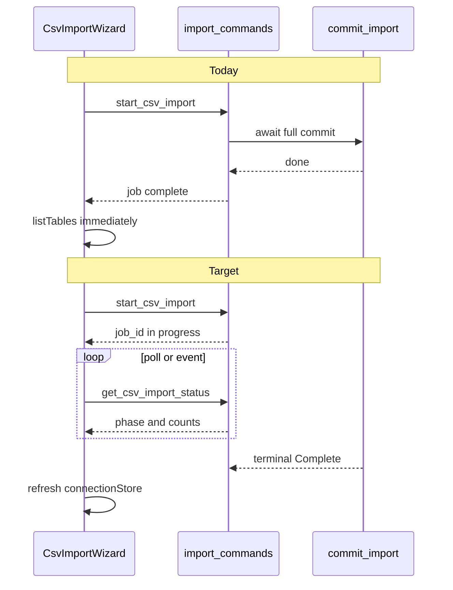
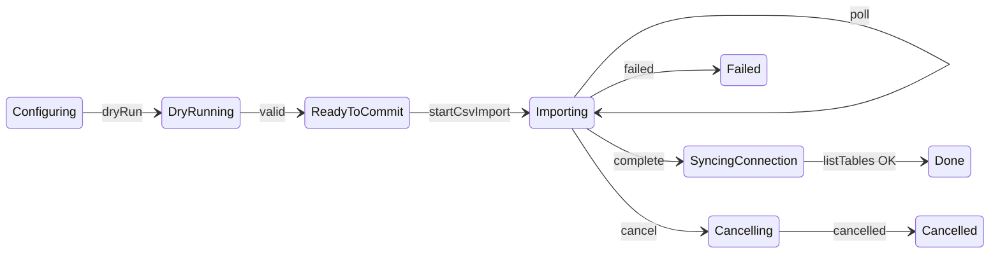

# Post-Audit Remediation Plan (Party-Mode Refined)

**Plan ID:** `post-audit-remediation-2026-05-27`
**Status:** Finalized for implementation
**Source:** Codebase audit (2026-05-27) + multi-agent party-mode review (backend, frontend, security)

**Objective:** Close P0/P1 audit findings for CSV import UX, test reliability, and import safety—without broad refactors to matching, egui, or GPU packaging.

**Party-mode consensus:** Async import (Phase 2) must ship **together with** security gates (session DB binding, real cancel, dry-run binding)—not as follow-ups. Merge performance (single-parse commit) into the same milestone as async. Defer keychain encryption, full Tauri ACL, and ResultStore memory caps to Phase 5.

---

## Implementation checklist

- [ ] **Phase 0:** Preflight dirty-worktree baseline + Rust build unblocker for `icu_locale_core` / Cargo cache access-denied
- [ ] **Phase 1:** Fix Vitest `resultsStore` persist tests, `.gitignore` artifacts, duplicate-check warnings, document cargo test env
- [ ] **Phase 2a:** `ImportJobHandle` + `commit_import_with_progress` + security gates (session DB, `plan_hash`, single-flight, real cancel) in Rust/Tauri
- [ ] **Phase 2b:** Single-parse commit path; avoid double validate+load in `commit_import` (same PR as 2a)
- [ ] **Phase 3:** `csvImportStore` + `CsvImportWizard` polling/cancel, defer connection refresh, a11y dialog, Vitest with mocks
- [ ] **Phase 4:** MySQL integration test docs/compose, update `csv-to-database-import-plan.md`, full test gate
- [ ] **Phase 5 (backlog):** keychain, Tauri ACL, ResultStore memory, staging table dedup, GPU docs — separate PRs

---

## Current vs target (import)



**Key files:**

- Rust import: `src/import/mod.rs`, `src/run_service/dto.rs`
- Tauri shell: `src-tauri/src/commands/import.rs`, `src-tauri/src/state.rs`
- Cancel pattern: `src/run_service/mod.rs` (`CancelToken`, `JobHandle`)
- UI: `ui/src/features/connect/CsvImportWizard.tsx`, `ui/src/features/connect/csvImportStore.ts`
- Spec: `docs/csv-to-database-import-plan.md`

---

## Phase 0 — Preflight and build-unblock gate (required before Phase 1)

This repository is already dirty, including files this plan will touch. Before implementation, capture the baseline and avoid mixing pre-existing work with new remediation changes.

```powershell
git status --short --branch
```

Record whether each modified/untracked file is in scope, already-existing baseline work, or an artifact that should be ignored/handled later. Do not remove screenshots, zips, or cache/build artifacts without explicit confirmation.

### Rust build blocker: `icu_locale_core` / Cargo registry access denied

The audit found root Rust gates blocked on this machine by a local Cargo registry/cache permission issue while unpacking/reading `icu_locale_core v2.0.0`:

```text
Access is denied. (os error 5)
```

Treat this as a **blocking validation prerequisite**, not a docs-only note. The goal is to distinguish app regressions from a corrupted or locked Windows Cargo cache.

Decision rule:

1. Try the normal/default Cargo cache first and capture the result.
2. If it fails on `icu_locale_core` or registry-cache access, rerun once with a fresh local `CARGO_HOME`.
3. If the fresh `CARGO_HOME` passes, classify the default-cache failure as an environment/cache blocker and use the fresh cache for implementation validation.
4. If the fresh `CARGO_HOME` also fails, classify it as a release-blocking Rust dependency/build failure.
5. Do **not** delete or repair existing Cargo cache directories inside this plan without separate confirmation.

Recommended Windows lane:

```powershell
$env:CARGO_HOME = "D:\GitProjects\name_match_latest\.cargo-test-home"
cargo fetch --locked
cargo check --locked
cargo test --locked --lib
cargo check --locked --manifest-path src-tauri\Cargo.toml
cargo test --locked --manifest-path src-tauri\Cargo.toml
```

Fallback if the repo-local cache is also suspect:

```powershell
$env:CARGO_HOME = "C:\cargo_nm_temp"
cargo check --locked
```

**Gate:** Phase 1 may start only after the worktree baseline is recorded and Rust validation can run with either the default cache or a documented fresh `CARGO_HOME` workaround.

---

## Phase 1 — Hygiene and fast fixes (≈1 day)

| Task | Files | Notes |
|------|-------|-------|
| Fix Vitest persist flakes | `ui/src/test-setup.ts`, `ui/src/__tests__/resultsStore.test.ts` | Prefer `useResultsStore.persist.clearStorage()` + `setState` in `beforeEach`; add rehydration test if asserting persist behavior |
| Repo hygiene | `.gitignore` | Add `*.zip`, `Screenshot*.png`, `sample.png`; exclude accidental `src-tauri/src-tauri.zip`. Existing untracked artifacts (`src-tauri/src-tauri.zip`, `src.zip`, screenshots, `sample.png`) should be left, ignored, or moved only after explicit confirmation. |
| Duplicate-check honesty | `src/import/mod.rs` ~L47 | Replace `count_existing_duplicates(...).unwrap_or(0)` with structured degraded dry-run status/warning when DB probe fails; document or fix 10k-row cap in duplicate scan. Prefer `duplicate_probe_status: complete | sampled | failed` over only a human warning string. |
| Rust build unblocker | `.cargo/config.toml`, `rust-toolchain.toml`, README / docs | Reproduce and fix or work around Windows Cargo failure around `icu_locale_core` registry/cache access denied. Verify with clean/project-local `CARGO_HOME`, document required env vars, and ensure CI uses clean cache. Do not proceed to Phase 2 until `cargo test` can run reliably. |

**Gate:**

```powershell
Push-Location ui
pnpm lint
pnpm test
pnpm build
Pop-Location

$env:CARGO_HOME = "D:\GitProjects\name_match_latest\.cargo-test-home"
cargo check --locked
cargo test --locked --lib
```

All current Vitest files must pass; record final file/test counts in validation evidence instead of hard-coding a count such as `20/20`.

---

## Phase 2 — Async import core + security gates (≈3–4 days)

### 2a — Backend job model (extend existing registry, no parallel type)

Upgrade `AppState.import_jobs` in `src-tauri/src/state.rs` from `HashMap<String, CsvImportJobDto>` to **`ImportJobHandle`**:

```rust
// Conceptual shape (implement in state.rs or import module)
struct ImportJobHandle {
    job: CsvImportJobDto,
    cancel: CancelToken,  // reuse name_matcher::run_service::CancelToken
    // optional: join handle for spawned task
}
```

**`start_csv_import`** (`src-tauri/src/commands/import.rs`):

1. `enforce_session_database(session, &request.target.database)` — reject if `request.target.database != session.database`
2. Required **`dry_run_id` / `plan_hash`** binding for mutating imports:
   - `validate_csv_import_plan` returns a backend-owned `dry_run_id` plus canonical `plan_hash`.
   - Store `ParsedImportPlan` / dry-run snapshot in `AppState` with `{ dry_run_id, session_id, target database/table, request_hash, file metadata, created_at }` and a short TTL.
   - Hash canonical request fields plus file metadata: path, size, modified timestamp, delimiter, encoding, mapping, target mode, duplicate policy, and destructive-confirmation flag.
   - `start_csv_import` rejects missing, expired, mismatched, or cross-session dry-run IDs/hashes.
3. **Single-flight guard**: one active mutating import per `session_id` (or per `(database, table)`)
4. Clone `MySqlPool` before spawn (same pattern as `matching.rs` L48–83)
5. Register in-progress job **before** work; return `job_id` immediately
6. `tokio::spawn` async task calling new `commit_import_with_progress(pool, req, on_update, cancel)`
7. DTO/schema contract gate: update Rust DTOs, TypeScript mirror, Zod schemas, and command signatures together whenever phases/progress fields change.

**`commit_import_with_progress`** (`src/import/mod.rs`):

- Update `CsvImportJobDto` each batch (L166–183 loop): `phase`, `processed_rows`, `current_batch`
- Check `cancel.is_cancelled()` between batches; set `phase: Cancelled` + message (“partial import possible” / “truncate not undone” for Replace)
- On failure: `phase: Failed`, `error: Some(...)`; keep job in map for polling
- Set unused phases where appropriate: `CreatingIndexes`, `RefreshingSource` (or remove from public contract if unused)
- **Do not** re-run full `validate_import_plan` on commit if the backend dry-run snapshot is present and `plan_hash` matches (Phase 2b). If the snapshot is missing/expired, fail and ask the UI to re-run dry-run rather than silently reparsing.
- Avoid holding `std::sync::Mutex` guards across async boundaries. Use short critical sections or `tokio::sync` primitives for async job state.
- Sanitize job errors/events so they never include credentials, connection strings, or raw SQL with sensitive values.

**`cancel_csv_import`:** call `CancelToken::cancel()` on handle; do **not** only `HashMap::remove`

**`get_csv_import_status`:** return live snapshot from handle

**Job retention:** terminal jobs remain readable for polling after completion/cancel/failure, then expire by TTL/max retained jobs. `cancel_csv_import` should request cancellation and keep status visible.

**Disconnect policy:** `disconnect_db(session_id)` must return a validation error while any non-terminal import exists for that session. Do not orphan a running task by closing its pool.

**Atomicity / cancel semantics by target mode:**

- `Create`: prefer staging table + rename to final after import/index success.
- `Append/Update`: batch commits may be partial unless wrapped in a transaction; document partial semantics and preserve honest terminal messages.
- `Replace`: do not leave the destination silently empty. Either use staging + atomic swap, or v1 cancellation is only honored before destructive DDL/DML starts and status clearly says it is cancelling after the current critical section.

### 2b — Single-parse commit (same PR as 2a)

Party-mode: **do not ship async without this.**

- Dry-run parses once into a backend-owned `ParsedImportPlan { people, dry_run }` snapshot or durable batch stream.
- Commit consumes that backend snapshot. The frontend must not carry parsed people back to Rust.
- Commit path: **one** `load_import_people` (or stream) — avoid `validate_import_plan` + double load inside `commit_import` (`mod.rs` L106–122, L40–41)
- `skip_revalidate` is allowed only when backend-owned `dry_run_id` + `plan_hash` match.

### 2c — Optional v1.1 (same sprint if low cost)

- Tauri event `csv-import-progress` mirroring job DTO (aligns with matching events + import plan); polling remains fallback

**Gate:**

- Manual: 10k-row CSV shows live progress; UI never freezes on commit
- Cancel mid-import: terminal `Cancelled`, honest message about partial DB state
- `cargo test` unit tests in `src/import/mod.rs`: cancel between batches, `validate_ident` rejects bad names, concurrent start rejected, dry-run/commit mismatch rejected, Replace cancel message honest
- Cross-schema import rejected
- Rust/Tauri contract gate:

```powershell
$env:CARGO_HOME = "D:\GitProjects\name_match_latest\.cargo-test-home"
cargo check --locked
cargo test --locked --lib import
cargo check --locked --manifest-path src-tauri\Cargo.toml
cargo test --locked --manifest-path src-tauri\Cargo.toml
```

---

## Phase 3 — Frontend import UX (≈2 days, after 2a lands)

Phase 3 starts only after the W2 API/DTO contract is stable:

- Rust DTO: `src/run_service/dto.rs`
- TypeScript mirror: `ui/src/shared/tauri/types.ts`
- Zod schema: `ui/src/shared/tauri/zod-schemas.ts`
- Command signatures: `ui/src/shared/tauri/commands.ts`

Choose the final `startCsvImport` contract before store work begins. Recommended: return a `CsvImportJobDto` with `job_id` and an initial active phase, not only `{ job_id: string }`, so the UI can render immediately while polling.

### Store (`csvImportStore.ts`)

Split monolithic `loading` into `previewLoading`, `dryRunLoading`, `importRunning`; add `jobId`, `importStatus: idle | running | cancelling | terminal`, poll generation guard.

Store owns timer lifecycle via actions such as `startImport`, `pollImportStatus`, `cancelImport`, `stopPolling`, and `finishTerminalImport`. Do not put polling ownership directly in `CsvImportWizard.tsx`.

Every async preview/dry-run/import response must be ignored unless its local request generation still matches store state. Polling stops on `complete`, `failed`, `cancelled`, wizard close/unmount, session/side mismatch, or newer import generation replacing the older loop.

Keep frontend `importStatus: "cancelling"` as UI-only. Backend terminal phase remains `"cancelled"`; do not add a Rust enum variant only for the UI transient state.

### Wizard (`CsvImportWizard.tsx`)

| Change | Rationale |
|--------|-----------|
| `commit()` calls `startCsvImport` then polls `getCsvImportStatus` (500ms → cap 2s backoff) | No per-tick toasts |
| Cancel button → `cancelCsvImport` | Real backend cancel |
| Defer `listTables` / `setMode` / `savePersistedConnection` until `phase === complete` | Today refreshes before import finishes (L135–153) |
| Close during import: disable normal close unless user chooses Cancel import; if confirm-close is allowed, keep background polling or provide recovery | Prevent orphan background job |
| Progress UI: batch bar + row counts | Use `current_batch`, `total_batches`, `processed_rows` |
| `role="dialog"`, `aria-modal`, focus trap | a11y gap from review |
| Terminal: one toast (success / error / cancelled) | |

Commands already exist in `ui/src/shared/tauri/commands.ts` L93–98—wire only.

Progress percent logic:

1. Prefer `processed_rows / total_rows`.
2. Fallback to `current_batch / total_batches`.
3. Use indeterminate progress when totals are zero or unknown.

A11y details:

- Initial focus moves to the dialog title or first invalid/required field.
- Escape is disabled or confirm-gated while import is running.
- Progress region uses `role="status"` / `aria-live="polite"`.
- Errors use `role="alert"`.
- Cancel button has deterministic focus after entering cancelling state.
- Background content is inert or otherwise shielded from tab order.

Post-complete refresh failure handling:

- A successful import remains successful even if `listTables`, `getTableColumns`, or `getRowCount` fails afterward.
- Show a “refresh failed” warning and keep the wizard open with a retry refresh action.

**State machine (wizard + import lifecycle):**



**Gate:** Wizard/store Vitest with mocked invoke + fake timers:

- `listTables` called **once** after complete, not on start
- cancel calls `cancelCsvImport(jobId)` once
- polling continues until backend reports `cancelled`
- polling timer clears on terminal state
- stale poll response does not overwrite newer import
- close during import is blocked or confirm-gated
- refresh failure after `complete` does not turn successful import into failed import

DTO/schema parity gate:

```powershell
Push-Location ui
pnpm lint
pnpm test -- zod-schemas
pnpm test
pnpm build
Pop-Location
```

---

## Phase 4 — Tests and CI (≈1–2 days)

| Item | Action |
|------|--------|
| MySQL integration | Document `MYSQL_IMPORT_TEST_URL` for `tests/csv_import_mysql.rs`; optional `docker-compose` service for CI nightly |
| MySQL integration command | `$env:MYSQL_IMPORT_TEST_URL = "<mysql-url-for-local-test-database>"; cargo test --locked --test csv_import_mysql -- --ignored --nocapture`; test must drop `csv_import_smoke` before and after |
| Zod | Extend `ui/src/__tests__/zod-schemas.test.ts` for import job phases if schema changes |
| ConnectTab | Keep smoke test; add import command mocks when wizard tests exist |
| Docs | Update `docs/csv-to-database-import-plan.md`: cancellation v1 = supported; partial-commit semantics |
| Rust build environment | Run Rust gates with default cache and clean/project-local `CARGO_HOME`; record exact workaround if Windows cache locking or `icu_locale_core` access denied recurs |

**Gate:** Rust unit/Tauri checks + UI lint/test/build; integration `#[ignore]` runnable locally with env var.

Release-readiness classification:

- **Green:** UI lint/test/build, root Rust with fresh `CARGO_HOME`, Tauri Rust check/test, and MySQL ignored test either passed or explicitly deferred with reason.
- **Yellow:** all code gates pass but MySQL integration is deferred.
- **Red:** ICU still blocks with fresh `CARGO_HOME`, DTO/schema mismatch exists, or cancel/progress tests are missing.

---

## Phase 5 — Deferred backlog (separate PRs)

| Item | Priority | Notes |
|------|----------|-------|
| OS keychain for saved passwords | P2 | `ui/src/features/connect/persistence.ts` — keep opt-in warning until then |
| Tauri invoke ACL per command | P2 | `src-tauri/capabilities/default.json` comment vs reality |
| ResultStore memory / spill-only mode | P2 | `src/run_service/store.rs` — `source_people` / `target_people` retention |
| `PAGE_LIMIT` tuning in ResultsTab | P3 | Separate perf PR; default 1000 |
| Staging table + SQL duplicate probe | P2 | Per performance remediation doc; reduces N+1 in dry-run |
| GPU release profile docs | P3 | `src-tauri` `--features gpu` |
| egui deprecation | P3 | `src/bin/gui.rs` dev-only |

---

## Acceptance criteria (done definition)

1. **Functional:** Connect → CSV wizard → dry-run → commit → table selected on correct side; matching run path unchanged.
2. **Honesty:** Progress and cancel reflect backend; Replace/cancel explains partial/truncated state.
3. **Security:** `target.database` equals session DB; no password in import errors/events; identifier validation unchanged.
4. **Performance:** UI non-blocking; commit path ≤1 full CSV parse (plus optional preview).
5. **Quality:** Unit + UI tests for cancel, terminal phases, connection refresh timing; CI documented.
6. **Build reliability:** Rust tests/builds are not blocked by `icu_locale_core` / Cargo registry permission errors on Windows; the documented fresh `CARGO_HOME` workaround is verified locally and CI uses a clean cache.

---

## Implementation order (swarm ownership)

| Wave | Owner focus | Deliverables |
|------|-------------|--------------|
| W0 | Preflight/build | Worktree baseline; `icu_locale_core`/Cargo cache blocker classified; fresh `CARGO_HOME` validation lane proven |
| W1 | Hygiene | Phase 1 complete |
| W2 | Rust engine + Tauri | Phase 2a–2b (`ImportJobHandle`, `commit_import_with_progress`, security gates) |
| W3a | React contract | DTO/Zod/command contract alignment after W2 |
| W3b | React store | Store polling/cancel state machine |
| W3c | React UI/a11y | Wizard UI, progress, close/cancel, refresh failure handling |
| W3d | React tests | Fake-timer and mocked-invoke tests |
| W4 | QA/Docs | Phase 4 + acceptance sign-off |

**Rollback boundary:** If async import slips, ship Phase 1 only; do **not** ship UI Cancel/poll until backend cancel is real (party-mode: false safety control).

---

## Party-mode refinements applied

- **Added Phase 0:** dirty-worktree baseline and `icu_locale_core`/Cargo cache build-unblock gate before implementation
- **Merged** Phase 2 + 3 (performance) from original draft — avoid async without single-parse
- **Rejected** new `ImportJobRegistry` type — extend `AppState.import_jobs`
- **Strengthened** dry-run binding: required backend-owned `dry_run_id` / `plan_hash` snapshot cache, not client-only hash
- **Added** must-ship gates: session DB binding, single-flight, DTO/schema parity, sanitized errors/events, active-import disconnect block, honest cancel/partial semantics
- **Clarified** atomicity/cancel semantics by target mode, especially Replace
- **Frontend:** defer connection refresh until complete; split loading; store-owned polling lifecycle; stale-generation guards; polling backoff; no toast spam; a11y details
- **Tests:** persist clearStorage over naive localStorage mock; wizard/store fake-timer tests after async API exists; DTO/Zod parity tests; dry-run mismatch and Replace cancel tests
