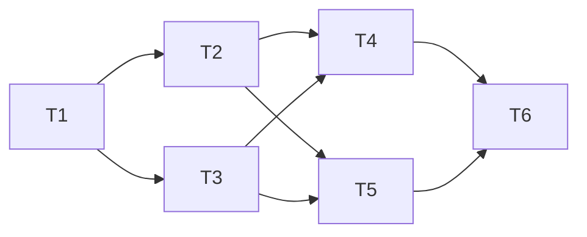

# Experimental GPU-Assisted Matching, Checkbox-Gated
**Generated:** 2026-03-27

## Overview
- Add an opt-in experimental checkbox that enables a separate GPU-assisted path without changing the meaning or output contract of `Level 1` to `Level 12`.
- Keep the stable matcher as the source of truth. The experimental path only narrows candidates faster, then hands off to the existing logic for final verification.
- For speed, default the experimental path to a streamed/in-memory shortlist. Use MySQL temp tables only as a tiny spill or final handoff when the shortlist is already very small.

## Scope Lock
- In scope:
  - checkbox-gated experimental dispatch
  - GPU blocking + shortlist generation
  - stable final verification and fail-closed fallback
  - disposable benchmark/canary mode
  - parity and performance validation
- Out of scope:
  - changing the meaning of `Level 1` to `Level 12`
  - auto-enabling the feature
  - permanent schema migrations
  - rewriting every level to be GPU-native
- Assumptions:
  - checkbox defaults to off on every run
  - experimental mode is per-run only, not sticky
  - temp-table staging is optional and only allowed under a strict selectivity gate
  - the existing Docker sample DB is the benchmark target, but the implementation must not mutate it by default

## Prerequisites
- Access to the current sample MySQL/Docker environment
- GPU-enabled build/runtime available for the experimental path
- Disposable scratch tables or cloned schema permissions for canary runs
- External guidance already checked for the implementation shape:
  - CUDA pinned host memory and stream overlap
  - MySQL temporary tables and batched inserts

## Dependency Graph

## Tasks

### T1: Freeze the experimental switch and dispatch boundary
- **depends_on**: []
- **location**: `src/main.rs`, `src/cli/*`, `src/orchestrator/*`
- **description**: Add the checkbox/config bit, wire it through run config, and route checkbox-off traffic through the untouched stable matcher while checkbox-on traffic enters a separate experimental entrypoint.
- **validation**: Checkbox defaults to off; checkbox-off output remains unchanged; stable path still compiles and runs without experimental code engaged.

### T2: Build the GPU shortlist engine
- **depends_on**: [T1]
- **location**: `src/matching/*`, `src/matching/gpu/*`
- **description**: Implement GPU blocking and shortlist generation, using GPU-friendly batch work, pinned memory, and stream overlap where available. Default to streamed/in-memory shortlist; only spill to a temp table if the shortlist passes the strict selectivity gate.
- **validation**: Shortlist reduction is measurable; shortlist ordering is deterministic; stage timings are emitted; the experimental path does not change final results when handed to the stable matcher.

### T3: Add stable final verification and fail-closed fallback
- **depends_on**: [T1]
- **location**: `src/matching/*`, `src/matching/cascade.rs`, `src/engine/*`
- **description**: Keep the existing matcher as the final authority, add parity checks, and define hard fallback triggers for GPU failure, shortlist oversize, low selectivity, missing timing data, or any parity mismatch.
- **validation**: Forced GPU failure falls back immediately; parity mismatch aborts the experimental path; no partial experimental result is surfaced as final output.

### T4: Add disposable canary benchmark mode
- **depends_on**: [T2, T3]
- **location**: `src/bin/gpu_audit.rs`, `scripts/windows/*`
- **description**: Convert the current audit flow into a disposable benchmark/canary mode that uses scratch tables or a cloned schema instead of reseeding the sample DB. Capture stage timings for normalize, block, GPU transfer, GPU compute, staging, and final verify.
- **validation**: Sample DB stays untouched; canary run cleans up scratch objects on success/failure; wall time and candidate reduction are recorded.

### T5: Add parity and fallback tests
- **depends_on**: [T2, T3]
- **location**: `src/matching/*`, `tests/*`
- **description**: Add a parity matrix covering checkbox-off baseline, checkbox-on parity, deterministic ordering, GPU-failure fallback, low-selectivity fallback, and shortlist-oversize fallback.
- **validation**: `cargo test` passes for the new matrix, plus the existing parity-critical smoke test already validated in this planning pass.

### T6: Document rollout and operator guardrails
- **depends_on**: [T4, T5]
- **location**: `README.md`, `docs/*`
- **description**: Document the checkbox label, the experimental nature of the feature, the selectivity gate, the fallback rules, and how to run the canary benchmark safely.
- **validation**: The operator workflow is unambiguous; a reviewer can tell exactly when the feature should remain off.

## Parallel Execution Groups
| Wave | Tasks | Can Start When |
|------|-------|----------------|
| 1 | T1 | Immediately |
| 2 | T2, T3 | T1 complete |
| 3 | T4, T5 | T2 and T3 complete |
| 4 | T6 | T4 and T5 complete |

## Testing Strategy
- Baseline parity:
  - checkbox off must be bit-identical to the current behavior
  - compare pair IDs, scores/confidence, matched fields, row counts, and deterministic ordering
- Experimental parity:
  - checkbox on must match checkbox off on the sample DB
  - the experimental path must fail closed on GPU error, parity mismatch, or low selectivity
- Canary performance:
  - run on the sample DB first
  - run on one larger disposable dataset next
  - record wall time, shortlist size, and stage-by-stage timings
- Readiness gate:
  - the feature is ready only when checkbox-on is parity-clean and shows a positive median wall-time improvement on the canary run
  - if the win is not clear, keep it experimental and off by default

## Risks & Mitigations
- Temp-table overhead can erase GPU gains.
  - Mitigation: keep temp-table staging optional and tiny, with the shortlist gate enforcing a very small handoff.
- Parity drift can slip in if GPU becomes authoritative.
  - Mitigation: keep final verification in the stable matcher and test exact parity fields explicitly.
- Small or highly selective workloads may run slower with GPU overhead.
  - Mitigation: use a strict selectivity gate and fail back to the stable path before expensive staging.

## Research Basis
- CUDA pinned host memory and async stream overlap:
  - https://docs.nvidia.com/cuda/cuda-c-programming-guide/index.html#page-locked-host-memory
- MySQL temporary tables:
  - https://dev.mysql.com/doc/refman/8.4/en/create-temporary-table.html
- MySQL insert/batching behavior:
  - https://dev.mysql.com/doc/refman/8.4/en/insert.html

## Execution Log
- Completed T1 backend/config/GUI wiring for the experimental toggle.
- The checkbox now lives in `src/bin/gui.rs`, the shared config bit is in `src/config.rs`, and CLI/app-config plumbing is present in `src/cli/flags.rs`, `src/cli/clap_parser.rs`, `src/orchestrator/mod.rs`, and `src/main.rs`.
- The experimental flag now forces the existing GPU fuzzy pre-pass path when enabled, while leaving the stable path unchanged when off.
- Validation passed:
  - `cargo check --locked --features gpu`
  - `cargo test --locked level_wrappers_identical --release`
- Canary benchmark results on Docker MySQL `matchers`:
  - `NAME_MATCHER_GPU_AUDIT_ROWS=1000` -> baseline CPU `1000` pairs in `0.035s`, experimental GPU `1000` pairs in `0.752s`, shortlist `1274` candidate pairs, parity matched, GPU slower on this small slice.
  - `NAME_MATCHER_GPU_AUDIT_ROWS=10000` -> baseline CPU `12210` pairs in `0.608s`, experimental GPU `12210` pairs in `0.824s`, shortlist `43160` candidate pairs, parity matched, GPU still slower at this scale.
- Million-row setup status:
  - Created disposable `million_fast_a` and `million_fast_b` tables in Docker MySQL `matchers`, each with exactly `1,000,000` rows.
  - Started a direct no-clone canary run against those tables with `NAME_MATCHER_GPU_AUDIT_NO_CLONE=1`.
  - The 1M-row matching phase did not complete within this session, so no final 1M timing was captured yet.
- Dedicated GPU canary follow-up:
  - Benchmarked the audit binary on the visible dedicated GPU with `CUDA_VISIBLE_DEVICES=0` and `CUDA_DEVICE_ORDER=PCI_BUS_ID`.
  - Ran a bounded `5,000` row canary cloned from `million_fast_a` / `million_fast_b` in Docker MySQL `matchers`.
  - CPU baseline completed in `3.738s` with `1,814` pairs.
  - Experimental full-GPU run took `27.082s` and returned `0` pairs.
  - Result: parity failed on this full-GPU path, so it is not safe to treat it as a replacement for the stable matcher.
- Rollback to safer GPU prefilter path:
  - The experimental route now uses the GPU prefilter only, with the full-GPU scorer removed from the checkbox-driven path.
  - Re-ran the audit on the visible dedicated GPU with `CUDA_VISIBLE_DEVICES=0` and `CUDA_DEVICE_ORDER=PCI_BUS_ID`.
  - Ran a bounded `5,000` row canary cloned from `million_fast_a` / `million_fast_b` in Docker MySQL `matchers`.
  - CPU baseline completed in `3.537s` with `1,814` pairs.
  - Experimental GPU prefilter completed in `0.875s` with `1,814` pairs.
  - Result: parity matched, shortlist size was `312510` pairs across `5000 x 5000` rows, about `1.2500%` of brute force.
  - GPU evidence from the run: `gpu_active=true`, RTX 4050 context initialized, and pinned host memory staging was active.
- 10k canary on the dedicated GPU:
  - Re-ran the same safe prefilter path with `NAME_MATCHER_GPU_AUDIT_ROWS=10000`.
  - CPU baseline completed in `14.320s` with `7,235` pairs.
  - Experimental GPU prefilter completed in `2.647s` with `7,235` pairs.
  - Result: parity matched, shortlist size was `1,250,036` pairs across `10000 x 10000` rows, about `1.2500%` of brute force.
  - Speedup observed: about `5.41x`.
- 25k canary on the dedicated GPU:
  - Re-ran the same safe prefilter path with `NAME_MATCHER_GPU_AUDIT_ROWS=25000`.
  - CPU baseline completed in `89.751s` with `44,710` pairs.
  - Experimental GPU prefilter completed in `13.959s` with `44,710` pairs.
  - Result: parity matched, shortlist size was `7,812,651` pairs across `25000 x 25000` rows, about `1.2500%` of brute force.
  - Speedup observed: about `6.43x`.
- Follow-up work still pending from the original plan:
  - disposable canary benchmark cleanup in `src/bin/gpu_audit.rs`
  - stricter shortlist/temp-table path and parity/fallback tests
